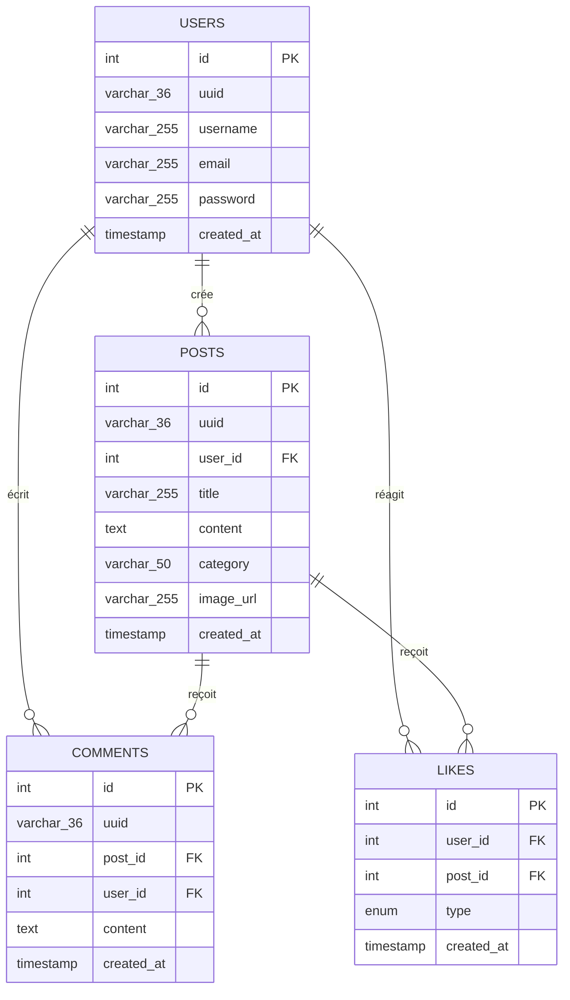

# 📘 Documentation Complète - Projet Forum de Discussion

Ce document présente l'architecture globale, la structure des fichiers, le schéma de la base de données et l'explication pas-à-pas des fonctionnalités clés de ton projet de Forum. Il a été conçu pour t'aider à comprendre parfaitement ton code et à le présenter avec clarté.

---

## 1. Architecture Globale du Projet

Le projet suit une architecture **Client-Serveur** classique (type SPA - Single Page Application) où le frontend et le backend sont séparés mais hébergés sur le même serveur Node.js.

### Schéma des flux de données

```mermaid
graph TD
  subgraph Frontend (Navigateur)
    UI[Interface HTML/CSS] <--> JS[script.js (Fetch API & DOM)]
  end
  subgraph Backend (Serveur Node.js)
    Server[server.js (Serveur HTTP Natif)] <--> Sessions[Sessions en mémoire]
    Uploads[Dossier /uploads/ (Stockage des images)]
  end
  subgraph Base de Données (MySQL)
    DB[(Base MySQL)]
  end

  JS -- 1. Requêtes HTTP (Fetch + Cookies de session) --> Server
  Server -- 2. Sert les fichiers statiques (HTML, CSS, Images) --> UI
  Server -- 3. Écrit les images physiques --> Uploads
  Server -- 4. Requêtes SQL (Lecture/Écriture) --> DB
```

---

## 2. Structure et Rôle des Fichiers

Voici le rôle exact de chaque fichier du workspace :

| Fichier | Langage | Description / Rôle clé |
| :--- | :--- | :--- |
| 📁 [uploads/](file:///c:/Users/kougn/Desktop/Projet%20Forum/uploads) | Dossier | Stocke physiquement toutes les images importées par les utilisateurs sous forme de fichiers binaires. |
| 📄 [db.js](file:///c:/Users/kougn/Desktop/Projet%20Forum/db.js) | JavaScript | Établit la connexion avec la base de données MySQL et exporte l'objet de connexion utilisable par le serveur. |
| 📄 [server.js](file:///c:/Users/kougn/Desktop/Projet%20Forum/server.js) | JavaScript (Node) | **Le cœur du backend** : Gère le serveur Web HTTP natif, le routage des requêtes (API et fichiers statiques), l'authentification (sessions), l'encodage et la persistance des images sur le disque dur, et les requêtes SQL vers MySQL. |
| 📄 [index.html](file:///c:/Users/kougn/Desktop/Projet%20Forum/index.html) | HTML5 | Page principale du forum : Contient le formulaire d'écriture de posts (avec prévisualisation d'images) et la zone d'affichage dynamique des publications. |
| 📄 [login.html](file:///c:/Users/kougn/Desktop/Projet%20Forum/login.html) | HTML5 | Page d'authentification (Connexion). |
| 📄 [register.html](file:///c:/Users/kougn/Desktop/Projet%20Forum/register.html) | HTML5 | Page de création de compte (Inscription). |
| 📄 [script.js](file:///c:/Users/kougn/Desktop/Projet%20Forum/script.js) | JavaScript | **Le cœur du frontend** : Récupère les données depuis l'API en utilisant `fetch()`, manipule le DOM pour afficher dynamiquement les posts (avec leurs avatars et le nombre de commentaires), filtre les publications (par recherche textuelle ou par onglets) et gère les interactions utilisateur (Likes, Dislikes, Ajout de commentaires, Suppression de post). |

---

## 3. Schéma de la Base de Données (MySQL)

Ta base de données est structurée autour de **4 tables** hautement connectées.



> [!TIP]
> **Le secret des contraintes `ON DELETE CASCADE`** :
> Les clés étrangères de `COMMENTS` et `LIKES` possèdent l'instruction `ON DELETE CASCADE` liée à la table `POSTS`. Ainsi, lorsqu'un utilisateur supprime un post, MySQL supprime automatiquement et proprement tous les commentaires et réactions correspondants !

---

## 4. Explication des Mécanismes Clés du Code

### A. La gestion des images (Base64 ➔ Fichier physique)
Pour éviter les configurations complexes d'envoi multipart (FormData), nous utilisons un canal JSON très propre :
1. **Frontend (`script.js`)** : Lorsque l'utilisateur sélectionne une image, un `FileReader` la convertit en chaîne **Base64** (une version textuelle de l'image). Cette chaîne est envoyée dans le JSON de création du post.
2. **Backend (`server.js`)** : Le serveur reçoit la chaîne textuelle Base64, en extrait l'extension (png, jpg), la décode sous forme de données binaires (`Buffer.from(data, 'base64')`), écrit l'image sous un nom unique (UUID) dans le dossier `/uploads/` avec `fs.writeFileSync()`, puis stocke le chemin `/uploads/nom-unique.png` en base de données.

### B. Le routeur personnalisé (sans Express)
Comme nous n'utilisons aucun framework (comme Express), `server.js` fait tout manuellement :
- **Servir les fichiers statiques** (`serveStatic`) : Si l'URL demandée correspond à un fichier réel (ex: `/index.html`, `/script.js`, `/uploads/image.png`), le serveur lit le fichier sur le disque avec `fs.readFile()` et le renvoie avec le bon en-tête `Content-Type` (HTML, CSS, JS, Image).
- **Le routeur d'API** : Le serveur analyse l'URL (`parsedUrl.pathname`) et la méthode HTTP (`GET`, `POST`, `DELETE`) pour exécuter le bloc de code SQL ou de session approprié (ex: `POST /posts` pour créer, `DELETE /posts/:id` pour supprimer).

### C. La barre de recherche dynamique et cumulée
Dans `script.js`, la fonction `filterPosts(type)` a été réécrite pour être intelligente :
Elle combine **deux filtres en un seul passage** (sur toutes les cartes de posts déjà affichées à l'écran) :
1. **Filtre de Navigation** : Affiche uniquement la catégorie sélectionnée (ex: Technologie, Aide) OU uniquement mes publications, OU les posts que j'ai aimés.
2. **Filtre de Recherche** : Cache les posts qui ne contiennent pas le mot-clé tapé (dans le titre ou le texte) par rapport à la recherche en temps réel de l'utilisateur.

### D. Les Avatars de Profil Dynamiques
La fonction `getAvatar(username, size)` utilise une astuce mathématique astucieuse :
- Elle prend le pseudo (ex: "Colombe"), calcule un nombre unique basé sur les codes Unicode des lettres de son pseudo, puis effectue un modulo pour obtenir un index de couleur dans une liste prédéfinie.
- **Résultat** : Un utilisateur donné aura **toujours** la même couleur d'avatar à l'écran, ce qui rend l'expérience visuelle d'un vrai réseau social très plaisante et cohérente, le tout généré 100% côté client sans charger la base de données.

### E. Le Système de Notifications Toast (Zéro Dépendance)
Afin d'éviter l'expérience utilisateur standard et terne induite par la fonction native `alert()` du navigateur, le projet intègre un moteur de notification Toast sur-mesure écrit en pur CSS et JavaScript :
1. **Frontend (`script.js` & Pages d'Auth)** : La fonction `showToast(message, type)` crée dynamiquement une carte HTML `.toast` avec son icône de statut (succès ✅, erreur ❌, avertissement ⚠️).
2. **Animation CSS (`style.css`)** : Les toasts utilisent des propriétés avancées de flou de verre (glassmorphism), des ombres portées dynamiques et s'animent de manière fluide grâce aux images clés `toastSlideIn` (entrée par la droite) et `toastSlideOut` (disparition progressive après un délai automatique de 3 à 4 secondes).
3. **UX Premium** : Pour l'authentification (`login.html` & `register.html`), un délai de redirection asynchrone de 1,2s est appliqué afin de permettre à l'utilisateur de lire la notification de succès avant d'être redirigé.

### F. Gestionnaire d'État Vide (Empty Search State)
Pour éviter un affichage vide et inesthétique lorsque la recherche d'un utilisateur ou le filtrage par onglet ne donne aucun résultat, le forum implémente un système d'état vide intelligent :
1. **Comptage en temps réel** : La fonction `filterPosts()` évalue le nombre de posts affichés. Si aucune carte n'est visible (`visibleCount === 0`), le système retire la classe `.hidden` du composant `#noResultsState` inséré dans `index.html`.
2. **Design Soigné** : Un encadré en pointillés transparent, minimaliste et épuré, qui s'intègre harmonieusement au ton élégant du forum.
3. **Bouton d'action direct** : Un bouton "Réinitialiser les filtres" réactive instantanément le flux complet des posts en un clic sans recharger la page.

### G. Synchronisation Dynamique de la Navigation (Navbar 🔗 Sidebar)
Pour éliminer les rechargements de page intempestifs et unifier la navigation :
1. **Interception des clics (SPA)** : Les liens de la barre de navigation supérieure ("Accueil", "Mes posts", "Posts aimés") possèdent des écouteurs d'événements interceptant les redirections pour appliquer des filtres JavaScript fluides et instantanés.
2. **Moteur de synchronisation (`updateActiveNavigation`)** : Cette fonction de liaison s'assure que dès qu'un utilisateur clique sur un onglet de la navbar supérieure, le bouton correspondant dans la barre latérale s'allume en bleu vif (`primary`), et inversement. La cohérence visuelle de l'interface est ainsi maintenue à 100% à tout moment.

---

## 5. Sécurité implémentée dans ton projet

1. **Sécurisation des mots de passe** : Les mots de passe des utilisateurs ne sont jamais stockés en clair. Ils sont hachés de façon irréversible à l'aide de l'algorithme robuste **bcrypt** avant l'insertion en BDD.
2. **Sécurité des Sessions (Anti-XSS)** : Le cookie `sessionId` envoyé au navigateur possède la directive `HttpOnly`. Cela empêche les scripts malveillants JavaScript d'accéder au cookie, protégeant ainsi l'identité de tes membres connectés.
3. **Sécurité des Actions Privées** : Lors de la suppression d'un post (`DELETE /posts/:id`), le serveur récupère le post en BDD et s'assure par une condition stricte que le `user_id` associé au post correspond bien au `id` de l'utilisateur connecté via sa session. Impossible de supprimer le post d'un autre utilisateur !
